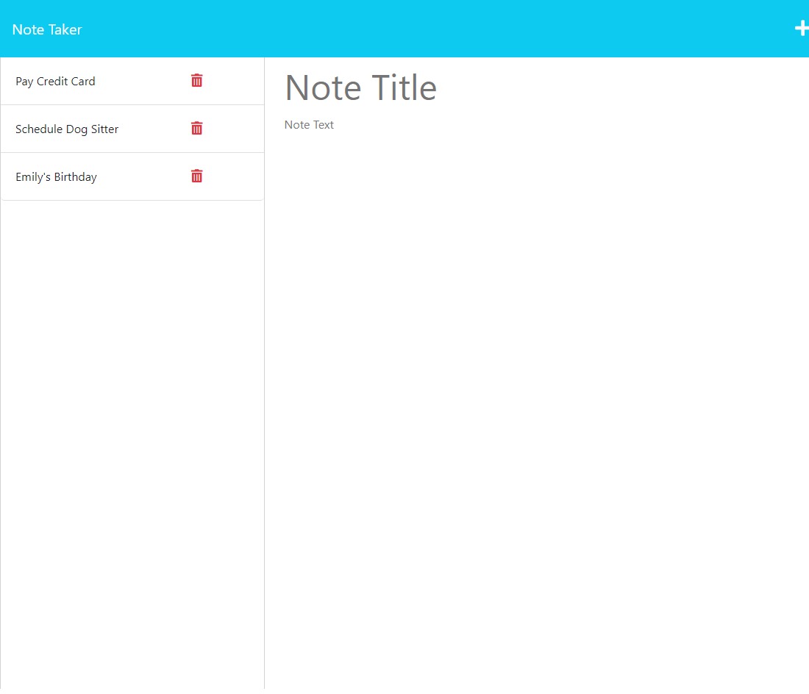

# NOTE TAKER

# Description

Application to store user notes

# Table of Contents

- [Installation](#installation)
- [Usage](#usage)
- [Contributing](#contributing)
- [Tests](#tests)
- [Questions](#questions)

# Installation

Visit deployed website at [https://nw-bc-note-taker.herokuapp.com/](https://nw-bc-note-taker.herokuapp.com/)

# Usage

Add a new note using the plus icon. Type in a title and description then click the disk symbol to save. Access saved notes via the side bar. Delete a selected note using the trash icon.

# Contributing

William George Thomas

# Tests

None at this time

# Questions

For further information:

- GitHub:

  - [https://github.com/WilliamGeorgeThomas](https://github.com/WilliamGeorgeThomas)

- Email:

  - williamgeorgethomas@gmail.com

# Screenshot

